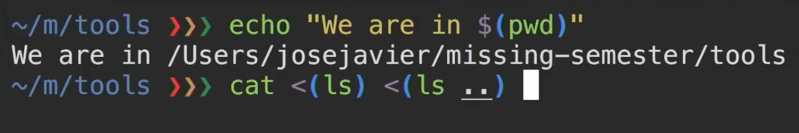

好的，以下是提取的关于 Bash 脚本和 Shell 工具的相关内容，以及相应的解释：

### Shell 脚本基础

1. **变量赋值和访问**
   - **示例**：
     ```bash
     foo=bar
     echo "$foo"  # 打印 bar
     echo '$foo'  # 打印 $foo
     ```
   - **解释**：`foo=bar` 为变量 `foo` 赋值，而 `$foo` 用于访问该变量的值。使用单引号时，不会进行变量替换。

2. **控制流**
   - **关键字**：`if`, `case`, `while`, `for`
   - **示例**：
     ```bash
     if [[ condition ]]; then
         # do something
     fi
     ```
   - **解释**：Bash 支持条件语句和循环，可以根据条件执行不同的操作。

3. **特殊变量**
   - **示例**：
     - `$0`：脚本名
     - `$1` 到 `$9`：脚本参数
     - `$#`：参数个数
     - `$?`：前一个命令的返回值
     - `$$`：当前脚本的进程ID
   - **解释**：这些变量用于获取执行环境和命令的相关信息。

4. **命令替换**
   - **示例**：
     ```bash
     for file in $(ls); do
         echo "$file"
     done
     ```
   - **解释**：使用 `$(CMD)` 语法获取命令 `CMD` 的输出，并用于后续操作。

5. **退出状态**
   - **示例**：
     ```bash
     false || echo "Oops, fail"  # 输出 "Oops, fail"
     true && echo "Success"       # 输出 "Success"
     ```
   - **解释**：`&&` 和 `||` 用于根据前一个命令的退出状态执行后续命令。

### Shell 工具

1. **查找文件**
   - **工具**：`find`
   - **示例**：
     ```bash
     find . -name '*.tmp' -exec rm {} \;
     ```
   - **解释**：`find` 命令用于查找文件并执行操作，这里是删除所有 `.tmp` 文件。

2. **查找内容**
   - **工具**：`grep`
   - **示例**：
     ```bash
     grep 'pattern' filename
     ```
   - **解释**：`grep` 用于在文件中搜索匹配的模式，可以使用不同选项如 `-R` 递归搜索。

3. **命令历史**
   - **工具**：`history`
   - **示例**：
     ```bash
     history | grep find
     ```
   - **解释**：查看之前执行过的命令，可以利用管道与 `grep` 结合过滤。

4. **目录导航**
   - **工具**：`fasd`, `autojump`
   - **示例**：
     ```bash
     z cool_project  # 使用 fasd
     j cool_project  # 使用 autojump
     ```
   - **解释**：这两个工具帮助用户快速导航到频繁访问的目录。

5. **使用手册**
   - **工具**：`man`
   - **示例**：
     ```bash
     man ls
     ```
   - **解释**：使用 `man` 命令查看命令的详细使用手册和选项。

6. **shebang**
   - **示例**：
     ```bash
     #!/usr/bin/env python
     ```
   - **解释**：在脚本开头指定解释器，确保脚本在不同环境中的可移植性。


以下内容不建议使用，请阅读[官方讲义](https://missing-semester-cn.github.io/2020/shell-tools/)。

---


# Lecture 2: Shell Tools and Scripting

## Shell 脚本与 Bash 控制流

本节我们将学习两个与 Shell 相关的主题：**Bash 脚本** 和 **便捷的 Shell 工具**。这些工具可以帮助我们避免重复操作，如查找代码片段或文件。上节我们已经介绍了 Shell 的基本使用方法，今天我们将进一步学习如何在 Bash 中进行变量定义、控制流以及函数定义。

### 变量定义与使用

在 Bash 中，定义变量非常简单，可以直接使用 `=` 进行赋值：

```bash
foo=bar
```

要访问变量的值，可以使用 `$` 符号：

```bash
echo $foo  # 输出: bar
```

**注意**：在赋值时，变量名与等号之间不能有空格，否则会被解释为命令及其参数。例如：

```bash
foo = bar  # 错误：被解释为执行 foo 命令，参数为 `= bar`
```

### 字符串与引号

Bash 中可以使用双引号或单引号定义字符串：

- **双引号**：会解析变量，将变量的值插入到字符串中。

    ```bash
    foo=bar
    echo "The value is $foo"  # 输出: The value is bar
    ```

- **单引号**：不会解析变量，保持字符串的原样。

    ```bash
    echo 'The value is $foo'  # 输出: The value is $foo
    ```

### 控制流与函数

Bash 支持常见的控制流语法，如 `for` 循环、`while` 循环，以及 `if` 条件判断。此外，还可以定义函数来封装一系列命令。以下是一个简单的 Bash 函数示例：

```bash
mcd() {
    mkdir -p "$1"  # 创建目录
    cd "$1"        # 进入该目录
}
```

在这个例子中，`$1` 表示传递给函数的第一个参数，这是 Bash 中的特殊变量，类似于其他编程语言中的 `argv`。

你可以在 Shell 中直接定义函数，也可以将其写入脚本文件中并通过 `source` 命令加载：

```bash
source script.sh
```

这样，脚本中的函数将被加载到当前的 Shell 环境中。

### 特殊变量

Bash 中有很多特殊的内置变量，可以帮助你在脚本中获得各种信息：

- **`$0`**：脚本的名称。
- **`$1` - `$9`**：传递给脚本的第一个到第九个参数。
- **`$?`**：上一个命令的退出状态（`0` 表示成功，非 `0` 表示失败）。
- **`$__`**：上一个命令的最后一个参数。

例如，使用 `$__` 可以访问上一个命令的最后一个参数：

```bash
mkdir test
cd $__  # 进入 test 目录
```

### 重用上一个命令

我们可以使用 `!!`（bang-bang）来重用上一个命令。这在我们需要以超级用户权限重新运行某个命令时特别有用：

```bash
sudo !!
```

这会将上一个命令替换为 `sudo` 前缀，提示输入密码后再执行。

### 错误处理与标准流

在 Bash 中，每个命令执行后都会返回一个 **退出状态码**，你可以通过 `$?` 来获取上一个命令的返回码。

- **`0`**：表示命令成功执行。
- **非 `0`**：表示命令失败。

例如：

```bash
echo hello
echo $?  # 输出: 0
```

如果执行一个无效的 `grep` 命令，则会得到非零状态码：

```bash
grep foobar some_script.sh
echo $?  # 输出: 1
```

### 逻辑操作符

我们可以使用逻辑操作符 `&&` 和 `||` 来控制命令的执行：

- **`&&`**：仅在第一个命令成功时执行第二个命令。

    ```bash
    true && echo "This runs"  # 输出: This runs
    ```

- **`||`**：仅在第一个命令失败时执行第二个命令。

    ```bash
    false || echo "This runs"  # 输出: This runs
    ```
    

### 命令替换与输出重定向

我们可以将命令的输出存储到变量中，使用命令替换：

```bash
foo=$(pwd)  # 将当前工作目录存储到变量 foo
echo $foo
```

### 进程替换

进程替换允许将命令的输出作为文件传递给其他命令，使用语法 `<(command)`：

```bash
diff <(ls dir1) <(ls dir2)
```

这将比较 `dir1` 和 `dir2` 目录下的文件列表。



**示例脚本**

下面是一个简单的示例脚本，演示了如何使用变量、命令替换和输出：

```bash
#!/bin/bash

current_date=$(date)
echo "当前日期是: $current_date"

# 创建一个目录并进入
mcd() {
    mkdir -p "$1"
    cd "$1" || exit
}
mcd "test_directory"

# 列出当前目录内容
ls
```


## Shell 脚本中的参数与错误处理

在 Bash 中，处理参数和错误是编写脚本的重要部分。以下是一些关键概念和示例。

### 特殊变量

- **`$0`**：当前脚本的名称。
- **`$#`**：传递给脚本的参数个数。
- **`$$`**：当前进程的 PID。
- **`$@`**：所有传递给脚本的参数，可以在循环中使用。

## 使用 `for` 循环处理参数

可以使用 `for` 循环遍历所有传递给脚本的参数。例如，以下示例中，我们检查每个文件是否包含字符串 `foobar`：

```bash
for file in "$@"; do
    grep foobar "$file" > /dev/null 2>&1  # 把输出和错误都重定向到 /dev/null
    if [ $? -ne 0 ]; then
        echo "$file doesn't have foobar"
        echo "# This file has foobar" >> "$file"  # 追加注释到文件
    fi
done
```

### 输出与错误重定向

使用 `/dev/null` 可以丢弃输出和错误：

```bash
grep foobar "$file" > /dev/null 2>&1
```

这行命令中，`>` 用于重定向标准输出，`2>&1` 用于将标准错误重定向到标准输出。

## 检查文件存在性

使用 `-f` 选项可以检查文件是否存在：

```bash
if [ -f "$file" ]; then
    echo "$file exists."
fi
```

### 示例脚本

下面是一个示例脚本，演示如何使用以上概念：

```bash
#!/bin/bash

current_date=$(date)
echo "当前日期是: $current_date"

for file in "$@"; do
    if [ -f "$file" ]; then
        grep foobar "$file" > /dev/null 2>&1
        if [ $? -ne 0 ]; then
            echo "$file doesn't have foobar"
            echo "# This file has foobar" >> "$file"  # 追加注释到文件
        else
            echo "$file contains foobar"
        fi
    else
        echo "$file does not exist."
    fi
done
```


## 脚本参数处理与文件名扩展

在 Bash 中，有效处理参数和文件名扩展是编写灵活脚本的重要技能。以下是一些关键概念及示例。

### 文件名扩展（Globbing）

Bash 允许使用通配符（如 `*` 和 `?`）来匹配文件名，这种方式称为 globbing。

- **`*`**：匹配零个或多个字符。例如，`*.sh` 匹配所有以 `.sh` 结尾的文件。
- **`?`**：匹配一个字符。例如，`project?` 匹配 `project1`、`project2` 等。

## 组合使用

使用花括号 `{}` 可以进行复杂的文件名扩展。例如，如果我们想将 PNG 图像转换为 JPEG 格式，可以这样写：

```bash
convert image.{png,jpeg}
```

这行命令会扩展为 `convert image.png` 和 `convert image.jpeg`。

### 生成组合

通过组合不同的模式，可以生成笛卡尔积。例如：

```bash
mkdir foo{1..3}bar{A..C}
```

这将创建 `foo1barA`、`foo1barB`、`foo1barC` 等多个目录。

### 进程替换

进程替换可以在命令之间传递输出。例如，比较两个目录中不同的文件：

```bash
diff <(ls dir1) <(ls dir2)
```

这会显示 `dir1` 和 `dir2` 中不同的文件。

### 使用其他脚本语言

虽然 Bash 非常强大，但在某些任务中，其他脚本语言（如 Python）可能更合适。以下是一个简单的 Python 脚本示例，用于处理命令行参数：

```python
#!/usr/bin/env python3

import sys

for arg in reversed(sys.argv):
    print(arg)
```

- **魔法行**：`#!/usr/bin/env python3` 是指示 shell 使用 `env` 命令查找 Python 解释器的方式。这样可以避免硬编码 Python 路径，从而提高跨平台兼容性。

## Bash 脚本中的工具与调试

### 调试工具

Bash 并不总是直观，错误可能很难追踪。以下是一些调试工具和技巧：

- **Saltech**：这是一个可以识别语法错误和警告的工具，特别适合找出未正确引用的字符串或文件名中的空格问题。例如，对于一个简单的 `mcd.sh` 文件，Saltech 可以指出缺失的语句和潜在的错误。

- **使用 `cd` 命令的安全性**：建议在使用 `cd` 时加上错误检查。例如，可以这样写：

    ```bash
    cd /path/to/directory || exit
    ```

    如果 `cd` 失败（如无权限或目录不存在），则脚本会立即退出，防止后续命令在错误目录中执行。

### 了解命令与选项

使用 `man` 命令可以查找各种命令的详细信息和选项。例如，`man ls` 可以查看 `ls` 命令的所有可用选项，如 `-l`（以列表形式列出文件）和 `-i`（提示交互式确认）。

- **自定义安装工具**：某些第三方工具（如 `Ripgrep`）会提供自己的 man 页面，确保用户可以查阅相关信息。

### 额外资源：TLDR

尽管 man 页面信息丰富，但有时难以理解。可以使用 `TLDR` 工具，它提供更易读的示例和简化的说明。这个社区贡献的工具对于如 `FFmpeg` 和 `TAR` 等命令尤其有用。

### 示例命令组合

在使用 `tar` 命令时，常常需要结合多个选项：

```bash
tar -cvf archive.tar /path/to/directory
```

此命令将指定目录打包为 `archive.tar` 文件。通过结合选项，可以灵活地执行文件操作。

## 查找文件与内容

在 Unix 系统中，查找文件和文件内容是非常常见的需求。以下是一些实用的命令和工具。

### 使用 `find` 命令

`find` 命令是一个强大的工具，适用于递归搜索文件和目录。例如，要查找当前目录中的所有名为 `src` 的目录，可以使用以下命令：

```bash
find . -name "src" -type d
```

这条命令会在当前目录下递归查找所有名为 `src` 的目录。`find` 命令还有许多有用的选项，比如查找特定类型的文件或按照修改时间、大小等进行筛选。

**示例：查找 Python 脚本**

查找当前目录下所有扩展名为 `.py` 的文件，可以使用：

```bash
find . -name "*.py" -type f
```

### 删除临时文件

`find` 还可以执行操作，例如删除特定类型的文件：

```bash
find . -name "*.tmp" -exec rm {} \;
```

这条命令会查找所有 `.tmp` 文件并将其删除。可以先测试不执行删除操作，以确保查找结果符合预期。

### `locate` 命令

对于经常需要查找的情况，`locate` 命令可以提供更快的搜索速度，因为它依赖于一个预先构建的索引。运行 `locate` 时，可以快速找到包含特定子字符串的路径：

```bash
locate "missing semester"
```

这个命令会迅速返回所有包含 “missing semester” 的文件路径。

### `grep` 命令

在 Unix 系统中，`grep` 是查找文件中内容的主要工具。使用 `-R`（或 `--recursive`）选项，可以递归搜索整个目录树。例如，若要查找包含 “foobar” 的文件，可以执行：

```bash
grep -R "foobar" .
```

此命令会返回所有包含该字符串的文件及其位置，方便快速定位。

## 使用 `ripgrep`

`ripgrep`（简称 `rg`）是 `grep` 的高效替代工具，具有更快的搜索速度和更友好的输出格式。它支持颜色编码和 Unicode，且默认忽略 `.git` 目录。使用示例：

```bash
rg "import requests" ~/scratch
```

此命令会在 `~/scratch` 目录下搜索所有包含 `import requests` 的行。

### 获取上下文

为了获取搜索结果周围的上下文，可以使用 `-C` 选项。例如，获取每个匹配行上下各五行的内容：

```bash
rg -C 5 "your_function_name"
```

这在查找函数使用位置时特别有用。

### 更复杂的搜索

可以使用正则表达式（regex）进行更复杂的匹配。例如，查找不包含特定模式的文件：

```bash
rg -L "^#!" -t sh
```

这条命令查找所有不以 Shebang（`#!`）开头的 Shell 脚本，便于检查缺失 Shebang 的脚本。

### 使用 `ack` 和 `ag`

除了 `grep` 和 `ripgrep`，还有其他工具如 `ack` 和 `ag`（The Silver Searcher），它们都是用于代码搜索的替代工具，具有各自的优缺点。根据个人需要选择使用即可。

### 查找命令历史

在命令行中，查找之前输入的命令可以通过多种方式实现：

1. **使用上箭头键**：逐条回顾命令历史，但效率较低。
   
2. **使用 `history` 命令**：打印出命令历史。可通过 `history | grep "convert"` 过滤出包含 `convert` 的命令。

3. **向后搜索**：在 Bash 中，使用 `Ctrl + R` 可进行反向搜索，输入关键词可快速找到对应的命令，并可以重新执行。

4. **使用 FZF**：FZF 是一个命令行模糊查找器，能高效地从命令历史中搜索，提供更直观的交互方式。

### 使用 FZF 进行模糊查找

FZF 是一个强大的模糊查找工具，允许用户以交互方式搜索命令历史或文件内容。通过将命令的输出通过管道传输到 FZF，可以方便地查找所需的字符串。例如：

```bash
history | fzf
```

这将显示历史命令列表，用户可以开始输入以动态过滤匹配项。

### 动态命令查找

使用 FZF 的一个优势是它可以动态匹配输入。例如，当用户输入 `convert to favicon` 时，FZF 会实时匹配并显示相关命令，免去手动编写正则表达式的麻烦。

### 历史子字符串搜索

历史子字符串搜索是一种有效的查找先前输入命令的方式。用户在输入命令时，Shell 会自动查找历史记录中以相同前缀开头的命令。按右箭头键可选择并执行这些命令。

## 目录列表和导航工具

### `tree` 命令

`tree` 是一个可视化目录列表工具，能够以树状结构打印目录内容，并使用颜色编码区分文件类型。例如，目录以蓝色显示，具有执行权限的文件为红色：

```bash
tree -C
```

### `brute` 工具

`brute` 是一个更为高级的工具，可以快速匹配和选择文件，简化目录导航。用户可以输入部分文件名来过滤结果，从而更快找到所需文件。

### 目录导航的效率提升

为了更高效地导航目录，可以使用 `cd` 命令结合书签、别名或符号链接。此外，工具如 **AutoJump** 可以根据用户的使用频率智能跳转到常用目录。虽然在当前环境中未加载，但这类工具非常实用。


| 命令/符号    | 作用                                         | 示例                                  |
| ------------ | -------------------------------------------- | ------------------------------------- |
| `=`          | 赋值操作                                     | `foo=bar`                             |
| `$`          | 访问变量值                                   | `echo $foo`                           |
| `!!`         | 重用上一个命令                               | `sudo !!`                             |
| `echo`       | 输出信息                                     | `echo "Hello, World!"`                |
| `-p`         | 创建目录时不报错，如果目录已存在             | `mkdir -p new_directory`              |
| `$(command)` | 命令替换，将命令的输出赋值给变量             | `current_date=$(date)`                |
| `<(command)` | 进程替换，将命令的输出作为文件传递给其他命令 | `diff <(ls dir1) <(ls dir2)`          |
| `grep`       | 在文件中搜索指定字符串                       | `grep "foobar" file.txt`              |
| `-R`         | 递归搜索整个目录树                           | `grep -R "foobar" .`                  |
| `find`       | 查找文件和目录                               | `find . -name "*.sh"`                 |
| `-name`      | 指定查找文件的名称                           | `find . -name "src"`                  |
| `-type`      | 指定查找的文件类型                           | `find . -type d`                      |
| `-f`         | 检查文件是否存在                             | `if [ -f "$file" ]; then ...`         |
| `-exec`      | 对查找到的每个文件执行指定命令               | `find . -name "*.tmp" -exec rm {} \;` |
| `2>&1`       | 将标准错误重定向到标准输出                   | `command > /dev/null 2>&1`            |
| `&&`         | 逻辑与，只有在第一个命令成功时执行第二个命令 | `true && echo "This runs"`            |
| `||`         | 逻辑或，只有在第一个命令失败时执行第二个命令 | `false || echo "This runs"`           |
| `$?`         | 获取上一个命令的退出状态                     | `echo $?`                             |
| `$0`         | 当前脚本的名称                               | `echo "Script name is $0"`            |
| `$#`         | 传递给脚本的参数个数                         | `echo "Number of parameters: $#" `    |
| `$$`         | 当前进程的 PID                               | `echo "Current PID: $$"`              |
| `$@`         | 所有传递给脚本的参数                         | `for arg in "$@"; do ...; done`       |
| `>`          | 重定向标准输出到文件                         | `echo "Hello" > output.txt`           |
| `>>`         | 追加标准输出到文件                           | `echo "Hello" >> output.txt`          |
| `cd`         | 更改当前目录                                 | `cd /path/to/directory`               |
| `man`        | 查看命令的手册页                             | `man ls`                              |
| `tar`        | 打包和压缩文件                               | `tar -cvf archive.tar /path/to/dir`   |
| `locate`     | 快速查找文件                                 | `locate "missing semester"`           |
| `awk`        | 文本处理和数据提取工具                       | `awk '{print $1}' file.txt`           |
| `sed`        | 流编辑器，用于文本替换                       | `sed 's/foo/bar/g' file.txt`          |
| `history`    | 显示命令历史                                 | `history`                             |
| `CTRL + R`   | 反向搜索命令历史                             | 输入 `CTRL + R` 后输入关键词          |
| `tree`       | 以树状结构列出目录及文件                     | `tree -C`                             |
| `AutoJump`   | 智能跳转到常用目录                           | `j project1`                          |
| `-C`         | 颜色化输出                                   | `ls -C`                               |
| `curl`       | 用于发送和接收数据的工具                     | `curl -O http://example.com/file`     |
